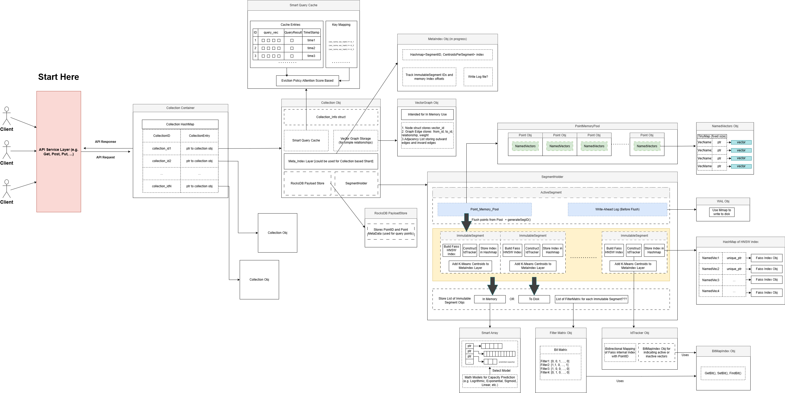

# jerry_vectorDB

Hello,

This is my first time writing a DB, to be specific, a vector database that AI agents or future robots can possibily use some kind of DB like this. Just by thinking about this future is already exciting. I know some C++ and I felt like I should give it a try even though it could be hard, pointless, or feeling void. But even void has a pointer (void*), so I am heading to some direction.  

The current DB only supports Dense Vectors, so to be continued with Sparse Vectors...

(update 11/4/2025): entering in slow dev mode...this github repo might not get updated frequently becasue I am trying to come up with jerry_vectordb 2.0 haha

## Note:
This repo is in slow developing mode...well my focus is shifting towards something else, so yeah. But i do learned a lot now about vector databases :)

## VectorDB architechture
I know it is not perfect, but hopefully I can improve it -.-



## Vector DB API
### python client: (not a package yet)
```
from vectordb_client import VectorDBClient
import vectordb_models as models

client = VectorDBClient()

config = models.CreateCollectionRequest(
        vectors=models.VectorParams(size=8, distance="L2"),
        on_disk="true"  # Changed to true
    )

or you can try:

config = models.CreateCollectionRequest(
        vectors={
            "image": models.VectorParams(size=3, distance="Dot"),
            "text": models.VectorParams(size=3, distance="Cosine"),
            "audio": models.VectorParams(size=3, distance="Cosine"),
        },
        on_disk="false"
    ) # the limit for named vectors is 8, hard coded in my db.

client.create_collection("my_collection", config)

client.list_collections()

points_list = [
        models.PointStruct(id="22s3", vector=[0.1, 0.2, 0.3, 0.4], payload={"label": "cat"}),
        models.PointStruct(id="12wer", vector=[0.5, 0.6, 0.7, 0.8], payload={"label": "dog"}),
        models.PointStruct(id="not-teder", vector=[0.12, 0.436, 0.7, 0.18], payload={"label": "wowow"}),
    ]

or you can do this:

points = [
        models.PointStruct(
            id="img_1",
            vector={
                "image": [0.1, 0.2, 0.3],
                "text": [0,  0.6, 0.7],
            },
            payload={"type": "image+text"}
        ),
        models.PointStruct(
            id="img_q",
            vector={
                "image": [0.4, 0.13, 0.23],
                "text": [0.35, 0.16, 0.7],
            },
            payload={"type": "image+text", "key": 43}
        ),
        models.PointStruct(
            id="img_df",
            vector={
                "image": [0.1, 0.1, 0.3],
                "text": [0.44, 0.5, 0.27],
                "audio": [1, 21, 10],
            },
            payload={"type": "image+text+audio", "key": 33}
        ),
        models.PointStruct(
            id="imqdfhhr",
            vector={
                "image": [0.12, 0.15, 0.27],
                "text": [0.3, 0.1, 0.17],
            },
            payload={"type": "happy dog", "key": 23}
        ),
        models.PointStruct(
            id="img_df",
            vector={
                "image": [0.1, 0.1, 0.3],
                "text": [0.44, 0.5, 0.27],
                "audio": [77, 20, 0],
            },
            payload={"type": "imwerweqttext", "key": 123}
        ),
    ]

print(client.upsert("my_collection", points))

client.delete_collection("my_collection") #not fully impl yet

```

### upsert an array of this:
```
(single vector per point)
{
  "id": "22s3",
  "vector": [0.1, 0.2, 0.3, 0.4],
  "payload": { "label": "cat" }
}
```

### or upsert an array of this:
```
(multi vector per point)
{
  "id": "img_1",
  "vector": {
    "image": [0.1, 0.2, 0.3],
    "text": [0.3, 0.6, 0.7],
    ...
  },
  "payload": { "type": "image+text" }
}
```

### For Querying (in python client of course)
Note: This is for the "default" named vector in the DB. 
```
client.query_points(
    collection_name="{collection_name}",
    query_vectors=[[0.2, 0.1, 0.9, 0.7]], # <--- Single Dense vector
    top_k=3 #<---default is 5, this is optional
)

or 

client.query_points(
    collection_name="{collection_name}",
    query_pointids=["43cf51e2-8777-4f52-bc74-c2cbde0c8b04"], # <--- single point id
)

or with batch query

client.query_points(
  collection_name="{collection_name}",
  query_vectors=[vector1, vector2, ...], (note -->one or more, error if none)  
  using="default",
  top_k=10,
)

//this one i think will just return the vector itself
client.query_points(
  collection_name="{collection_name}",
  query_pointids=["id1", "id2", ...], --> one or more, error if none
  using="default",
)

And the result will look something like this:
{
  "result": [
    { "id": "abcd", "score": 0.81 },
    { "id": "herwewf", "score": 0.75 },
    { "id": "qwer34wff-we", "score": 0.73 }
  ],
  "status": "ok",
  "time": 0.001
}

or this

{
  "result": [
    [
        { "id": "sdafr", "score": 0.81 },
        { "id": "qrt3f-ewf", "score": 0.75 },
        { "id": "qwe-qwer3-4-q", "score": 0.73 }
    ],
    [
        { "id": "dfgh-e-h", "score": 0.92 },
        { "id": "5-tf-wer-t4", "score": 0.89 },
        { "id": "ert-5-tw-erg-w", "score": 0.75 }
    ]
  ],
  "status": "ok",
  "time": 0.001
}
```

### Query with filters 

The using specifier here can make the user specify which named vector.
```

```
## TODO: (as of 10/30/2025, to be updated)
Need to write tests for each component. <br>
Need to improve performance, possibly add GPU stuff. <br>
Add user interface such as Qt desktop.<br>
Might need to redesign the payload store and filtermatrix. <br>
Could try to deploy to cloud.<br>

<hr>

Below is just some libs i used for this project.

```
//source: https://www.intel.com/content/www/us/en/developer/tools/oneapi/onemkl-download.html?operatingsystem=linux&linux-install=apt

sudo apt update

sudo apt install -y gpg-agent wget

wget -O- https://apt.repos.intel.com/intel-gpg-keys/GPG-PUB-KEY-INTEL-SW-PRODUCTS.PUB | gpg --dearmor | sudo tee /usr/share/keyrings/oneapi-archive-keyring.gpg > /dev/null

echo "deb [signed-by=/usr/share/keyrings/oneapi-archive-keyring.gpg] https://apt.repos.intel.com/oneapi all main" | sudo tee /etc/apt/sources.list.d/oneAPI.list

sudo apt update

sudo apt install intel-oneapi-mkl

sudo apt install intel-oneapi-mkl-devel

----------------------------------------------
sudo apt install libeigen3-dev

sudo apt-get install nlohmann-json3-dev

sudo apt install librocksdb-dev

sudo apt-get install libblas-dev liblapack-dev

sudo apt-get install swig

sudo apt-get install uuid-dev

git clone https://github.com/facebookresearch/faiss.git
cd faiss
cmake -B build -DFAISS_ENABLE_GPU=OFF -DFAISS_ENABLE_PYTHON=OFF .
make -C build -j faiss
sudo make -C build install

//installing grpc is just not working for me because protobuf versions mismatch, even though 
//I followed every instruction and watching old youtube videos or trying chatgpt stuff, spending
//3 days and a lot of cmake build hours, still not working, so i have to move one to other alternatives.

//----Yeah, ignore protobuf now---------
//install protobuf, git clone lastest, 
//cd in project, mkdir build && cd build
//then cmake -Dprotobuf_BUILD_TESTS=OFF .. because there is some weird test error in their cmakefile
//then do "make"
//then either sudo make install or make install
//-------------------------------------


The library for C++ standards https://github.com/abseil/abseil-cpp/tree/master is quite interesting to study the fundamentals in C++17

i have not tried to use the boost lib yet

https://capnproto.org/install.html for installing Cap'n Proto, better than protobuf


For configuration, uhm
```

